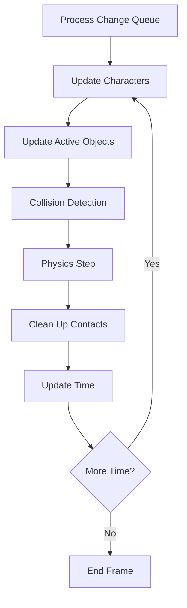

# ubODE Physics Scene Documentation

## Overview

The ubODE Physics Scene is the core physics simulation engine for Akisim (OpenSimulator), providing realistic physics behavior for avatars, objects, and environmental interactions. Built on the Open Dynamics Engine (ODE), it delivers high-performance collision detection, rigid body dynamics, and advanced vehicle simulation capabilities specifically optimized for virtual world environments.

## Architecture

### Module Structure

The ubODE physics system consists of several key components working together:

```
ubOdeModule (INonSharedRegionModule)
└── ODEScene (PhysicsScene)
    ├── OdePrim (PhysicsActor) - Primitive objects
    ├── OdeCharacter (PhysicsActor) - Avatars/characters
    ├── ODEDynamics - Vehicle physics
    ├── ODEMeshWorker - Asynchronous mesh processing
    └── ODERayCastRequestManager - Ray casting operations
```

### Core Classes

- **`ubOdeModule`** - Entry point implementing `INonSharedRegionModule`
- **`ODEScene`** - Main physics scene extending `PhysicsScene`
- **`OdePrim`** - Physics representation of primitive objects
- **`OdeCharacter`** - Physics representation of avatars
- **`ODEDynamics`** - Vehicle and advanced movement dynamics
- **`ODEMeshWorker`** - Background mesh processing thread
- **`ODERayCastRequestManager`** - Thread-safe ray casting system

## Configuration

### Startup Configuration

Enable ubODE in the `[Startup]` section of OpenSim.ini:

```ini
[Startup]
physics = ubODE
meshing = ubODEMeshmerizer  ; Required companion meshmerizer
```

### Physics Settings

Configure physics behavior in the `[ODEPhysicsSettings]` section:

```ini
[ODEPhysicsSettings]
; World gravity settings
world_gravityx = 0.0        ; X-axis gravity component
world_gravityy = 0.0        ; Y-axis gravity component  
world_gravityz = -9.8       ; Z-axis gravity (Earth-like)

; Simulation timing
world_stepsize = 0.020      ; Physics timestep in seconds (50 FPS)

; Avatar physics parameters
av_density = 80.0           ; Avatar density (affects mass/buoyancy)
av_movement_divisor_walk = 1.3  ; Walk speed scaling factor
av_movement_divisor_run = 0.8   ; Run speed scaling factor

; Collision detection settings
contacts_per_collision = 80     ; Maximum contact points per collision
geometry_default_density = 10.0 ; Default primitive density

; Flight and movement limits  
minimum_ground_flight_offset = 3.0  ; Minimum flight height above terrain
maximum_mass_object = 10000.01     ; Maximum object mass limit
```

## Physics Simulation

### Main Simulation Loop

The physics simulation follows a structured update cycle:



### Simulation Steps

1. **Change Processing** - Apply queued physics property changes
2. **Character Movement** - Update avatar positions and velocities
3. **Object Movement** - Update primitive object physics
4. **Collision Detection** - Detect and resolve collisions
5. **Physics Integration** - Apply forces and update positions
6. **Contact Cleanup** - Remove temporary collision joints

### Performance Parameters

- **Physics Rate**: 50 FPS (0.020s timesteps)
- **Solver Iterations**: 15 iterations per step for stability
- **Max Contacts**: 6,000 contact joints per frame
- **Contact Points**: 80 points per collision pair
- **Frame Drop**: Graceful degradation at 400ms lag

## Collision System

### Spatial Organization

ubODE uses a hierarchical spatial organization for efficient collision detection:

```
TopSpace (Global collision space)
├── ActiveSpace (Dynamic objects)
│   ├── Characters (Avatars)
│   └── Active Prims (Moving objects)
└── StaticSpace (Static objects - QuadTree)
    ├── Terrain
    ├── Static Prims
    └── Environmental objects
```

### Collision Categories

Objects are classified into collision categories for selective interaction:

```csharp
[Flags]
public enum CollisionCategories : uint
{
    Space =         0x01,    // Spatial containers
    Geom =          0x02,    // Primitive objects
    Character =     0x04,    // Avatars/characters
    Land =          0x08,    // Terrain
    Water =         0x010,   // Water bodies
    
    // Special states
    Phantom =       0x01000, // Non-colliding objects
    VolumeDtc =     0x02000, // Volume detection
    Selected =      0x04000, // Selected objects
    NoShape =       0x08000  // Objects without collision shape
}
```

### Material Properties

Different materials provide varying friction and bounce characteristics:

| Material | Friction | Bounce | Typical Use |
|----------|----------|--------|-------------|
| Stone    | 0.8      | 0.4    | Buildings, rocks |
| Metal    | 0.3      | 0.4    | Machinery, tools |
| Glass    | 0.2      | 0.7    | Windows, crystals |
| Wood     | 0.6      | 0.5    | Furniture, trees |
| Flesh    | 0.9      | 0.3    | Organic objects |
| Plastic  | 0.4      | 0.7    | Synthetic materials |
| Rubber   | 0.9      | 0.95   | Balls, tires |

## Object Management

### Primitive Objects (OdePrim)

Primitive objects represent physical entities in the world:

**Key Features:**
- **Dynamic Mesh Generation** - Meshes created via ODEMeshWorker
- **Physical States** - Physical, phantom, volume detection modes
- **Mass Calculation** - Automatic mass/inertia from geometry and density
- **Vehicle Support** - Integration with ODEDynamics for vehicles
- **PID Controllers** - Smooth position/rotation interpolation

**Object Collections:**
- `_prims` - All primitive objects in the scene
- `_activeprims` - Currently active/moving objects
- `_activegroups` - Active linked object groups

### Character Physics (OdeCharacter)

Avatar physics provides realistic character movement:

**Collision Geometry:**
- Capsule-based collision shape for smooth movement
- Configurable height and radius
- Separate collision handling for different movement states

**Movement States:**
- **Walking** - Ground-based movement with terrain following
- **Flying** - Aerial movement with configurable speed limits
- **Falling** - Gravity-based physics with impact detection

**Collision Avoidance:**
- Character-to-character collision prevention
- Smooth movement around obstacles
- Configurable personal space boundaries

## Advanced Features

### Vehicle Dynamics (ODEDynamics)

ubODE provides comprehensive vehicle physics supporting all LSL vehicle types:

**Vehicle Types:**
- **None** - Disable vehicle physics
- **Sled** - Ground-hugging vehicle
- **Car** - Wheeled ground vehicle
- **Boat** - Water surface vehicle
- **Airplane** - Aerial vehicle with lift
- **Balloon** - Lighter-than-air vehicle

**Physics Behaviors:**
- **Linear Motor** - Forward/backward propulsion
- **Angular Motor** - Rotational control
- **Banking** - Leaning into turns
- **Deflection** - Aerodynamic steering forces
- **Hover** - Altitude maintenance
- **Buoyancy** - Water interaction

### Ray Casting System

The `ODERayCastRequestManager` provides thread-safe ray casting:

**Ray Cast Types:**
- **Single Ray** - Simple point-to-point collision detection
- **Multiple Rays** - Batch processing for efficiency
- **Filtered Rays** - Category-based collision filtering

**Applications:**
- LSL `llCastRay()` implementation
- Avatar ground detection
- Vehicle sensor systems
- AI pathfinding assistance

### Mesh Processing (ODEMeshWorker)

Asynchronous mesh processing prevents simulation blocking:

**Features:**
- **Background Processing** - Meshes generated on separate thread
- **Queue Management** - Priority-based mesh generation
- **Cache Integration** - Works with ubODEMeshmerizer caching
- **Error Handling** - Graceful fallback for invalid meshes

## Threading and Performance

### Threading Architecture

ubODE uses a carefully designed threading model:

```
Main Thread (Physics Simulation)
├── Simulation Loop
├── Collision Detection  
├── Physics Integration
└── Event Dispatch

Background Threads
├── ODEMeshWorker (Mesh Generation)
└── ODERayCastRequestManager (Ray Casting)
```

### Thread Safety

- **Change Queue** - Thread-safe property updates via `ConcurrentQueue`
- **Lock Hierarchy** - `OdeLock` → `SimulationLock` prevents deadlocks
- **Memory Management** - Pre-allocated arrays and pinned memory
- **Event Synchronization** - Cross-thread event handling

### Performance Optimizations

**Spatial Partitioning:**
- QuadTree space for static objects
- Active/inactive object separation
- Hierarchical collision culling

**Contact Management:**
- Pre-allocated contact arrays
- Contact joint pooling
- Maximum contact limits

**Memory Efficiency:**
- Pinned memory for native interop
- Object pooling for frequently used structures
- Minimal garbage collection impact

## Integration Points

### OpenSimulator Framework

ubODE integrates seamlessly with OpenSimulator's physics framework:

- **Module Loading** - Dynamic loading via `INonSharedRegionModule`
- **Scene Registration** - Registers as primary `PhysicsScene`
- **Event System** - Collision and physics events to framework
- **Configuration** - Uses OpenSimulator configuration system

### Native ODE Library

ubODE requires a specially modified ODE library:

**Requirements:**
- Native ODE library with OpenSimulator extensions
- Platform-specific binaries (Windows, Linux, macOS)
- Version compatibility verification at startup

**Native Interface:**
- P/Invoke calls through `UBOdeNative` class
- Memory-safe parameter passing
- Exception handling for native errors

## Performance Tuning

### Key Parameters

**Physics Quality vs Performance:**
```ini
world_stepsize = 0.020          ; Smaller = more accurate, higher CPU
contacts_per_collision = 80     ; More contacts = better collision
```

**Memory Usage:**
```ini
maximum_mass_object = 10000.01  ; Prevents excessive memory use
geometry_default_density = 10.0 ; Affects mass calculations
```

**Character Performance:**
```ini
av_density = 80.0                    ; Avatar physics responsiveness
av_movement_divisor_walk = 1.3       ; Movement speed scaling
av_movement_divisor_run = 0.8        ; Affects server load
```

### Monitoring and Diagnostics

**Built-in Statistics:**
- Physics simulation time per frame
- Active object counts
- Collision contact statistics
- Memory usage tracking

**Debug Features:**
- Extensive logging via log4net
- Physics object state inspection
- Performance timing measurements
- Error reporting with context

## Troubleshooting

### Common Issues

1. **High CPU Usage**
   - Reduce `contacts_per_collision`
   - Increase `world_stepsize` (reduce accuracy)
   - Check for excessive active objects

2. **Character Movement Problems**
   - Verify avatar density settings
   - Check terrain collision mesh
   - Review movement divisor values

3. **Object Physics Issues**
   - Confirm mesh generation success
   - Check object mass and density
   - Verify collision categories

4. **Vehicle Problems**
   - Review vehicle parameter ranges
   - Check terrain interaction
   - Verify physics material properties

### Performance Troubleshooting

**Frame Rate Issues:**
- Monitor physics timing in logs
- Check active object counts
- Review collision complexity

**Memory Issues:**
- Monitor mesh cache usage
- Check for memory leaks in prims
- Review character collection sizes

### Debugging Tools

**Log Categories:**
- `[PHYSICS]` - General physics operations
- `[ubODE]` - ubODE-specific messages
- `[MESH]` - Mesh generation issues
- `[VEHICLES]` - Vehicle dynamics problems

## Future Considerations

### Planned Enhancements

- **GPU Acceleration** - CUDA/OpenCL physics computation
- **Improved Threading** - Better parallelization of collision detection
- **Advanced Materials** - Extended material property system
- **Network Optimization** - Reduced physics network traffic

### Compatibility Notes

- Requires ubODEMeshmerizer for full functionality
- Native library version compatibility critical
- Platform-specific optimizations available
- Configuration migration between versions

## Technical Specifications

### System Requirements

**Minimum Requirements:**
- .NET 8.0 runtime
- Native ODE library with OpenSim extensions
- 1GB RAM for physics simulation
- Multi-core CPU recommended

**Performance Characteristics:**
- 50 FPS physics simulation rate
- Supports thousands of active objects
- Sub-millisecond collision detection
- Scalable to large regions (1024x1024m+)

### Dependencies

- **OpenSim.Framework** - Core framework integration
- **OpenSim.Region.Framework** - Scene and actor interfaces
- **OpenSim.Region.PhysicsModules.SharedBase** - Physics base classes
- **log4net** - Logging infrastructure
- **Nini** - Configuration management
- **Native ubODE Library** - Core physics calculations

The ubODE Physics Scene represents a sophisticated, high-performance physics simulation system specifically designed for virtual world applications, providing the realistic physics behavior essential for immersive virtual environments.